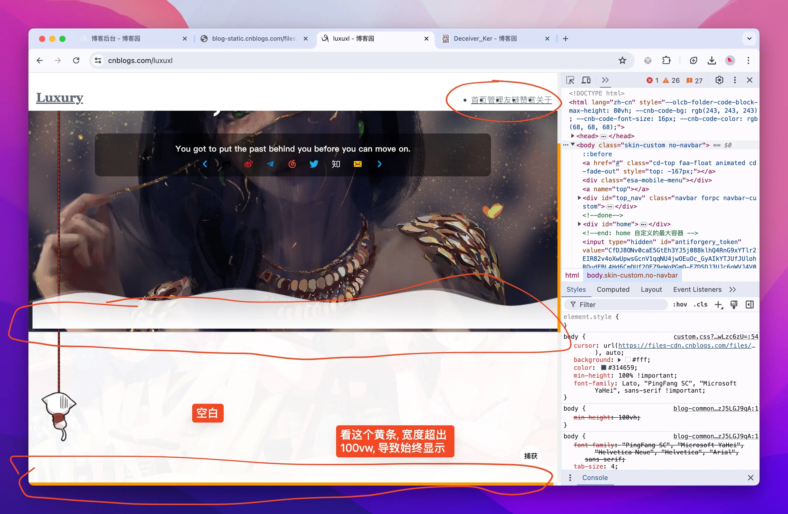

# 介绍

此主题是 [CNblogs-Theme-Sakura - Github](https://github.com/Zou-Wang/CNblogs-Theme-Sakura/tree/master) 的个人重制版

## 为什么重制

1. 一些资源已经失效, 还有错位
2. 删除自己不想要的东西
3. 将各个模块的调用, 按照视觉的从上到下顺序, 重新排版, 条理更加清晰

## 改动的内容

main.js 中删除的内容: (按照视觉的从上到下顺序, 后面是存在于哪个函数)

1. Github 左上角标 - buildGithubCorner()
2. 离开页面改变标题 - getMainMode()
3. 左上角的 "すのはら荘" 及相关效果 - buildCustomElements() & getMainMode() & goIntoNormalMode() & buildBloggerProfile()
4. 顶部工具栏的 友链 赞赏 关于 - buildCustomElements()
5. 顶部工具栏的子标签 - buildCustomElements()
6. 顶部滚动进度条 - scrollDy() & getScrollTop() & getScrollHeight() & getWindowHeight()
7. 全屏显示的, 回到顶部的小绳子 - buildCustomElements()
8. 文章下方的 推荐 收藏 反对 - buildPostFavoriteBtn()
9. 最下方的 Copyright...Powered by..., 已经错位, 可以自行美化 - buildCopyright()
10. 工具栏, 只看到最下面的 "捕获"? - buildToolbar()
11. *添加标签icon (原作者注释, 不知道具体是哪里的 icon) - buildCustomElements()
12. *Build a tags button on navbar (原作者注释, 可能是 topbar 的标签) - buildCustomElements()
13. *构建博主信息, 主页能搜到该元素, 但是看不见 - buildBloggerProfile()

main.js 中修改的内容: 
1. 个人信息, 这个肯定得改, avatar 是头像 url, favicon 是不知道 - constructor()
2. 修改 goIntoReadingMode() 和 goIntoNormalMode(), 这两个作用就是自动显示或隐藏顶部栏, 名字取得啥玩意??, 分别改成了 alwaysShowTopBar() 和 autoHideTopBar()
3. 移除顶部栏默认的选项, 设置自定义选项 - buildCustomElements()
4. 文章页作者信息, 变成获取 this.defaluts.profile 中的变量信息, 本来写死了原作者的主页 - constructor() & postHeader() 

css 中修改的内容: 
1. 光标, 恢复正常
2. 滚动条, 恢复正常
3. 宽度始终多出一点, 导致横向滚动条始终显示, 我真不知道怎么写出来的?? 已修复
4. 有个 scroll-down, 下拉的倒三角, 看不到, 干脆直接删了
5. 改太多了, 不想说了

## 待完善的内容

1. icon 失效问题, 比较懒, 有空再说
2. 消息弹窗的位置有问题, 似乎不是居中, 懒得搞了, 真烦死了
3. sponsor 加载问题, 有时候加载不出来, 原因未知

# 安装主题

你有两条路可以选

1. 懒得折腾, 将就用用我的配置 -> 请看懒人配置法
2. 不行, 我就要自定义 (建议有一定基础) -> 请看折腾党配置法

# 懒人配置法

1、修改博客园设置中的, 博客侧边栏公告, 代码如下

```html
<script src="https://blog-static.cnblogs.com/files/blogs/816612/main.js?t=1719499568"></script>
<script type="text/javascript">
$.silence({
});
</script>
```

2、修改 `$.silence({ });` 中的配置, 主要是 author、avatar、home, 其他请参考下方

```html
<script src="https://blog-static.cnblogs.com/files/blogs/816612/main.js?t=1719499568"></script>
<script type="text/javascript">
$.silence({
    profile: {
        author: "你想要显示的作者名",
        avatar: '你头像 url',
        home: '你主页 url',
        photos: '你相册 url',
    },
});
</script>
```

| 模块 | 属性 | 说明 | 类型 | 默认值 |
| --- | --- | --- | --- | --- |
| profile | author | 作者 | String | "Luxury" |
|  | avatar | 头像 url | String | - |
|  | home | 主页 url | String | - |
|  | photos | 相册 url | String | - |
| catalog | enable | 是否启用目录 | Boolean | true |
|  | move | 是否允许拖拽 | Boolean | false |
|  | index | 是否显示索引 | Boolean | true |
|  | level1 | 一级标题 | String | "h2" |
|  | level2 | 二级标题 | String | "h3" |
|  | level3 | 三级标题 | String | "h4" |
| signature | enable | 是否启用转载声明 | Boolean | true |
|  | license | 许可证名称 | String | "CC BY 4.0" |
|  | link | 许可证链接 | String | "https://creativecommons.org/licenses/by/4.0" |
| sponsor | enable | 是否启用打赏 | Boolean | true |
|  | paypal | PayPal 收款码 | String | - |
|  | alipay | 支付宝收款码 | String | - |
|  | wechat | 微信收款码 | String | - |
| topImg（头图） | homeTopImg | 首页头图链接 | Array | ["https://img2018.cnblogs.com/blog/1646268/201908/1646268-20190806172418911-2037584311.jpg",] |
|  | notHomeTopImg | 文章页头图链接 | Array | ["https://img2018.cnblogs.com/blog/1646268/201908/1646268-20190807151151330-1121103170.png",] |
| topInfo | titile | 头部标题 | String | "Hi, Toretto!" |
|  | text | 装逼的话 | String | "You got to put the past behind you before you can move on." |
|  | notice | 随笔列表上面的小框里的内容 | String | "undefined" |
|  | github | 社交媒体链接 | String | - |
|  | weibo |  | String | - |
|  | telegram |  | String | - |
|  | music |  | String | - |
|  | twitter |  | String | - |
|  | zhihu |  | String | - |
|  | mail |  | String | - |

3、修改博客园设置中的, 页面定制 CSS 代码, 并勾选禁用模版默认CSS, 由于代码过长, 不放在下面, 请到链接中复制

[CSS 链接](https://raw.githubusercontent.com/luxuxl/cnblogs-themes-re-sakura/main/body.css)

# 折腾党配置法

我将介绍如何安装, 再介绍如何折腾

## 如何安装

1、下载 main.js 文件

2、将 main.js 文件上传到自己博客园后台, 并获取链接

3、修改博客园设置中的, 博客侧边栏公告, 代码如下

```html
<script src="请替换成, 你在第二步, 获取的链接"></script>
<script type="text/javascript">
$.silence({
});
</script>
```

4、修改博客园设置中的, 页面定制 CSS 代码, 并勾选禁用模版默认CSS, 由于代码过长, 不放在下面, 请到链接中复制

[CSS 链接](https://raw.githubusercontent.com/luxuxl/cnblogs-themes-re-sakura/main/body.css)

5、至此, 安装完毕, 别忘记保存

## 如何折腾

折腾就是修改 main.js 代码 (当然也可以改 css, 但是 3000 行我真的不想介绍了)

修改完记得重新上传博客园后台

我将讲清楚 main.js 中各个模块的作用, 方便折腾 (水平有限, 错误之处见谅)

### 基础模块

- constructor(): 保存了一些基础信息, 如 是否启用、主页 url, 根据个人情况自行调整
- cnblogs(): 获取 cnblogs 自带的一些元素对象, 后面修改这些元素里的内容
- isPostPage(): 判断是否是文章页, 文章页为 1, 主页为 0
- init(): 根据 isPostPage() 生效不同的模块
- buildCustomElements(): 这是新增一些 html 元素, 大多已经被我删完了, 只剩个移动设备的啥玩意, 具体不太懂

接下来就是一些比较具体的模块, 我将分成 **主页生效模块** 和 **文章页生效模块**, 并按视觉上的从上到下顺序来介绍, 条理更加清晰

### 主页生效模块


- mainHeader(): 网格遮罩效果 (哈哈, 有点像那个大屏幕)、个性签名、社交 icon
- homeImg(): 设置主页图片
- autoHideTopBar(): 自动隐藏顶部栏
- setHomeSuiBiList(): 随笔列表和叫 notice 的 (无力吐槽)

### 文章页生效模块


- postHeader(): 文章的标题、作者头像、名称等
- setNotHomeTopImg(): 设置文章页的开头图片
- alwaysShowTopBar(): 始终显示顶部栏
- buildPostCatalog(): 目录
- buildPostCodeCopyBtns(): 代码复制按钮
- buildPostSignature(): 转载声明, 需要在博客园开启, 否则获取不到 #MySignature 元素
- buildPostSponsor(): 文章最后赞赏按钮
- buildPostCommentAvatars(): 评论区的头像

# 吐槽

按照原作者 Github 说明配置完, 一堆 Bug, 而且总感觉每次还都不一样

熬夜改了几个晚上, 眼睛都快瞎了

比如我碰到的 Bug: 




还有同样使用这个主题, 别人的 Bug: 


